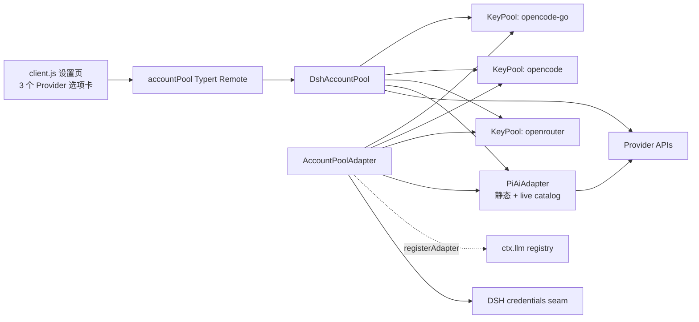
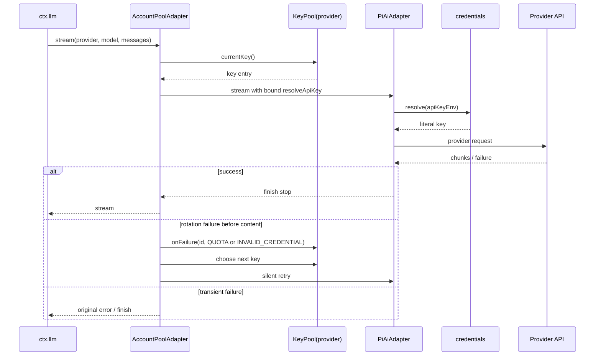

# dsh-account-pool 设计说明

> 当前实现版本：0.2.x
>
> 目标：在不修改 DSH 核心的前提下，把 OpenCode Go、OpenCode Zen 和 OpenRouter 的 Provider 路由统一到可配置的多 Key 账号池。

## 1. 范围与边界

本插件只负责三件事：

1. Provider 路由接管和按 Key 的请求级故障切换。
2. Provider 目录、用量和运行态在 Host 与设置页之间的投影。
3. 配置、凭据引用和 KeyPool 运行态的安全持久化。

不做代理服务、跨账号额度聚合、明文 Key 入库，也不修改 DSH 核心注册表或 api-proxy 白名单。

## 2. Provider 驱动表

| ID / 路由 | pi-ai Provider | 目录 | 用量 | 轮换策略 |
| --- | --- | --- | --- | --- |
| `opencode-go` | `opencodeGoProvider()` | OpenCode Go `/v1/models` | rolling / weekly / monthly | 401、额度失败 |
| `opencode` | `opencodeProvider()` | OpenCode Zen `/v1/models` | 暂无公开接口 | 401、额度失败 |
| `openrouter` | `openrouterProvider()` | OpenRouter `/api/v1/models` | `/api/v1/key` credits | 401、billing/credit；普通 429 不轮换 |

Provider-specific facts 只存在于 `driver-core.js` 和 `drivers.js`。`pool.js` 与 `AccountPoolAdapter` 不依赖具体 HTTP 协议。

## 3. 总体拓扑



Host 在一次插件实例中创建三个独立 KeyPool 和三个 pi-ai profile。请求仍通过一个 provider-neutral adapter 进入，`options.provider` 决定池、目录和失败分类。

## 4. 配置和迁移

新的设置结构为：

```js
{
  providers: {
    'opencode-go': { keys, preemptAtPercent, modelMode, models, ... },
    opencode: { keys, ... },
    openrouter: { keys, ... },
  },
}
```

`Config` 负责类型、范围和默认值；`validateSection` 负责每个 Provider 内 Key ID / credential ref 的唯一性；`putConfig` 再做跨字段校验，例如 custom 模式不能没有模型。

原版本的扁平 composition entry 在 `migrateEntryConfig()` 中转成 `providers.opencode-go`。由于新的设置 namespace 是 `dsh-account-pool`，旧版本用户层文档不会被自动覆写；需要在升级后检查一次设置页并重新保存配置。旧运行态文件也保留，新版本使用每个 Provider 独立的状态文件。

## 5. 请求流程和失败分类



统一轮换码为 `QUOTA`、`INVALID_CREDENTIAL` 和 `AUTH`。OpenCode 的额度/credit/billing 文案归入 `QUOTA`；OpenRouter 的 401 归入 credential，402 或 account-level billing/credit 归入 `QUOTA`，普通 429 保留原错误码交给上层重试。

内容已经输出后不能在同一 stream 内重放；此时先写入 KeyPool 轮换状态，再把错误上交 DSH 的重试层。

## 6. KeyPool 状态机

状态：`healthy`、`exhausted`、`disabled`、`invalid`。`activeId` 是独立的池级指针，不创建第五种状态。

- `syncKeys` 更换配置列表，保留仍存在的运行态。
- `currentKey` 跳过非 healthy、用量达到 `preemptAtPercent` 的 Key。
- `onFailure` 处理额度/凭据轮换，或按可选 consecutive threshold 处理连续瞬时失败。
- `onUsage` 保存 provider-neutral usage facts，并按 `usage.revive` 或 Go rolling window复活 exhausted Key。
- 所有状态变更原子写入 `$DSH_HOME/dsh-account-pool.<provider>.state.json`。

用量事实使用统一外壳：

```js
{
  kind: 'windows' | 'credits' | 'unsupported',
  preemptPercent: number | null,
  revive: boolean,
  rolling: Window | null,
  weekly: Window | null,
  monthly: Window | null,
  credits: Credits | null,
}
```

## 7. 目录一致性

pi-ai 的 `Models` 集合会按 profile Map 的对象身份缓存。live catalog 变化时，Host 不直接修改旧 Map，而是创建新的 profile Map 并重建对应 profile；这样：

- 新的 `listModels`、`resolveModel` 和 stream 看到新目录。
- 已经开始的请求继续使用原始快照，不会在中途换 Provider 或模型描述。
- 已注册路由通过 `registration.replace([provider])` 重新公布目录和 retry facts。

OpenCode live response 只接受静态 catalog 已认识的模型或显式安全 override，避免把未知协议字段盲目送入 pi-ai。OpenRouter `/models` 可按 OpenAI-compatible metadata 映射新模型，价格从每 token 转为 pi-ai 的每百万 token单位。

## 8. Typert Remote

Host manifest 的 package/service/namespace 均为 `dsh-account-pool` / `accountPool`。所有参数和结果使用 strict codec，共 9 个方法：

```text
status()
setActive(provider, id)
setDisabled(provider, id, on)
clearInvalid(provider, id)
putKeys(provider, keys)
putKeySecret(provider, id, secret)
putConfig(provider, config)
takeOverState(provider)
refreshModels(provider)
```

状态返回根对象 `{ version, providers }`，每个 Provider 返回接管状态、目录、Key 状态、用量和最近切换。明文 Key 只在 `putKeySecret` 的 credentials seam 写入时短暂存在，不进入 settings 或 status。

## 9. Client 约束

`client.js` 必须保持 lazy-CJS：顶层只执行 `window.__ModuleLoader__.load({ id, factory })`，React、Remote 和 UI 逻辑都在 factory materialize 后执行。Remote descriptor 与 Host manifest 的方法顺序、参数顺序和服务名保持一致。

页面状态以根 status 为来源，Provider 选项卡只切换本地选择，不把不同 Provider 的 Key 或配置混在一起。Go 展示三个窗口，OpenRouter 展示额度比例和金额，Zen 展示无公开用量提示。

## 10. 验证矩阵

| 层 | 验证 |
| --- | --- |
| 静态 | `node --check`：Host、Client、manifest、driver、catalog、usage |
| 纯 Node | KeyPool 状态机、失败分类、用量解析、目录映射 |
| Client contract | 无 React 依赖执行 bundle，检查 loader id、Remote 严格 codec、settings slot |
| Host smoke | 需要 DSH peer dependencies，检查三条路由、dry pool、接管、静默 failover |
| Typert | 需要 `@deepseek-ai/dsh-typert-loader`，验证 9 个 invocation 的 strict codec |
| UI render | 需要 React / react-dom，检查卡片、窗口/额度展示、模型选择和错误边界 |

当前 checkout 若未安装 DSH/React peer dependencies，只能把对应 Host/UI 项标记为 skipped，不能把它们当作真实加载或 UI 验收通过。
